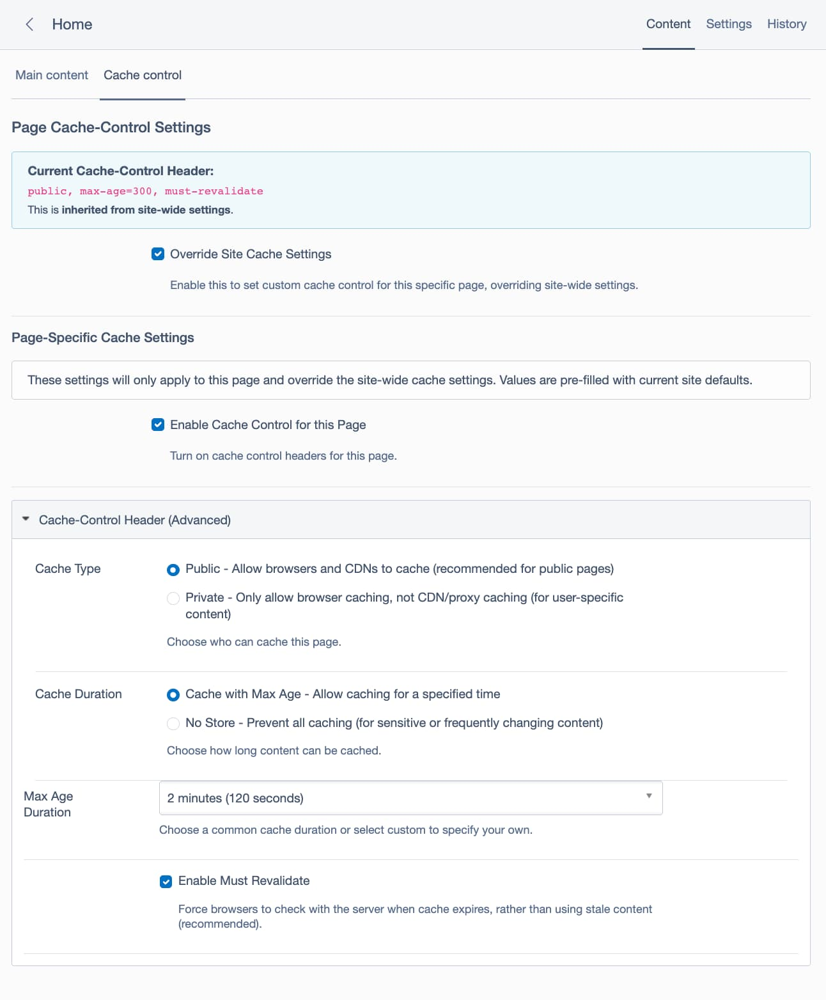

# Silverstripe Cache Control

[](https://github.com/edwilde/silverstripe-cache-control/actions/workflows/ci.yml)

A Silverstripe CMS module that gives content editors control over HTTP Cache-Control headers at both site-wide and page-specific levels.



## Features

- **Site-wide cache control settings** via SiteConfig
- **Page-level cache control overrides** for granular control
- **User-friendly CMS interface** with clear explanations for non-developers
- **Conditional field visibility** using DisplayLogic
- **Performance optimised** - minimal database queries
- **Sensible defaults** - 120 seconds cache time
- **Cache inheritance** - optionally apply cache settings to all descendant pages (opt-in via config)

## Version Compatibility

| Version | Branch | CMS Version | PHP Version |
|---------|--------|-------------|-------------|
| 2.x     | `main` | CMS 6       | PHP 8.3+    |
| 1.x     | `cms5` | CMS 5       | PHP 8.1+    |

## Requirements

- Silverstripe CMS 6.0+
- PHP 8.3+
- [nswdpc/silverstripe-cache-headers](https://github.com/nswdpc/silverstripe-cache-headers) (CMS 6: `dev-ss6` branch — no tagged release yet)
- [unclecheese/display-logic](https://github.com/unclecheese/silverstripe-display-logic) ^4.0

## Installation

```bash
composer require edwilde/silverstripe-cache-control
```

> [!NOTE]
> The `nswdpc/silverstripe-cache-headers` dependency currently requires its `dev-ss6` branch for CMS 6 (no tagged release yet). Your project will need `"minimum-stability": "dev"` and `"prefer-stable": true` in its `composer.json`.

After installation, run:

```bash
vendor/bin/sake dev/build flush=1
```

## Usage

### Site-wide Settings

Navigate to **Settings > Cache Control** in the CMS to configure default cache headers:

- **Enable Cache Control**: Master switch for the entire site
- **Cache Type**: Choose between Public (CDN + browser) or Private (browser only)
- **Cache Duration**: Choose between Max Age (time-based caching) or No Store (no caching)
- **Max Age Duration**: Select from common preset durations (2 min, 5 min, 10 min, 1 hour, 1 day) or choose Custom
- **Custom Max Age**: When "Custom" is selected, enter your own cache duration in seconds
- **Enable Must Revalidate**: Force validation when cache expires (recommended)

### Vary Header Settings

The **Vary Header** section in site-wide settings controls which request headers cause separate cache entries to be stored. This tells browsers and CDNs to cache different versions of a page based on these headers:

- **Accept-Encoding**: Store separate entries for different compression methods (gzip, br, etc). Enabled by default and recommended for most sites.
- **X-Forwarded-Protocol**: Store separate entries for HTTP vs HTTPS requests.
- **Cookie**: Store separate entries when cookies differ. Use for personalised content.
- **Authorization**: Store separate entries based on authentication. Use for protected content.

Vary headers are configured site-wide only — they apply consistently to all pages, including those with page-level cache control overrides.

### Page-specific Overrides

Each page has a **Cache Control** tab where you can:

1. View the current effective cache control header
2. Enable override to set page-specific settings
3. Configure the same options as site-wide settings

The page will show whether settings are inherited from site config or overridden at the page level.

### Cache Inheritance (Section-Level Overrides)

For sites with large sections that need different cache settings (e.g., an `/archive` section with 1000+ pages), you can configure a parent page's cache settings to automatically apply to all its descendant pages.

This feature is **disabled by default** because it adds database queries per request to walk the page tree. Enable it in your project's YAML config:

```yaml
# app/_config/cache-control.yml
SilverStripe\CMS\Model\SiteTree:
  enable_cache_inheritance: true
```

Once enabled:

1. Navigate to the parent page (e.g., `/archive`) in the CMS
2. Enable **Override Site Cache Settings**
3. Configure the desired cache settings (e.g., 1 day / 86400 seconds)
4. Check **Apply to child pages**
5. Save

All descendant pages that don't have their own cache override will now use the parent's cache settings. The Cache Control tab on each child page will show the inherited source (e.g., "inherited from Archive").

**How inheritance resolves:**

1. If a page has its own cache override → uses its own settings
2. If an ancestor has "Apply to child pages" enabled → uses the **nearest** ancestor's settings
3. Otherwise → uses site-wide settings

> [!NOTE]
> This uses runtime tree-walking, not save-time propagation. Changes to a parent's cache settings take effect immediately on the next request to any child page. There is no need to re-save child pages.

> [!TIP]
> For typical Silverstripe sites with 3-5 levels of page depth, the performance overhead is minimal (1-4 additional database queries per uncached request). If your site has deeply nested page trees, consider whether the convenience outweighs the query cost.

## Cache Control Options Explained

### Public vs Private
- **Public**: Content can be cached by browsers, CDNs, and proxy servers. Best for pages that are the same for all users.
- **Private**: Content can only be cached by the user's browser. Use for personalised content.

### Max Age
Specifies how long (in seconds) the content can be cached before it must be revalidated. The module provides a dropdown with common preset values for ease of use:
- **2 minutes** (120 seconds) - Default, good for frequently updated content
- **5 minutes** (300 seconds) - Balance between freshness and performance
- **10 minutes** (600 seconds) - For moderately static content
- **1 hour** (3600 seconds) - For content that changes infrequently
- **1 day** (86400 seconds) - For highly static content
- **Custom** - Enter your own value in seconds for specific requirements

### Must Revalidate (Recommended)
Forces browsers to check with the server when the cache expires, rather than serving potentially stale content. **This is enabled by default and recommended for most scenarios** to ensure users receive fresh content when the cache expires.

### Cache Duration: No Store
Completely prevents caching. Use for sensitive or rapidly changing content. When "No Store" is selected, all other caching options (max-age, must-revalidate) are ignored and the Cache-Control header will only contain "no-store".

## Technical Details

### Architecture

The module consists of three main components:

1. **CacheControlSiteConfigExtension**: Adds cache control fields to SiteConfig
2. **CacheControlPageExtension**: Adds page-level override functionality and optional cache inheritance from parent pages
3. **CacheControlContentControllerExtension**: Applies the appropriate cache control headers to responses, resolving from page override → ancestor inheritance → site config

### HTTP Headers

The module sets the following HTTP headers:

- **Cache-Control**: The primary caching directive (e.g., `public, max-age=300`)
- **Expires**: Automatically set to match the Cache-Control max-age for HTTP/1.0 compatibility

When max-age is specified, the Expires header is calculated as the current time plus the max-age value in GMT format. This ensures compatibility with older HTTP/1.0 caches and proxies while maintaining full HTTP/1.1 Cache-Control support.

### Performance Considerations

- The middleware only applies headers when no Cache-Control header already exists
- Page overrides are checked first to avoid unnecessary SiteConfig lookups
- All cache settings are stored as database fields for optimal performance
- No additional queries are made if cache control is disabled
- **Cache inheritance** (`enable_cache_inheritance`) is disabled by default. When enabled, each uncached page request walks up the page tree (typically 3-5 levels) to find an ancestor with "Apply to child pages" enabled. This adds O(d) queries where d is the tree depth. When disabled, zero additional queries are made — behaviour is identical to the module without this feature.

### Middleware Priority

The middleware runs after request processors to ensure it can detect the current page context. It will not override any Cache-Control headers already set by controllers or other middleware.

## Development

### Development with Symlinks

If you're developing this module and using a symlink in a Silverstripe project:

1. The module's `vendor/` directory should be excluded from Silverstripe's class manifest
2. Either remove the vendor directory from the module when symlinking:
   ```bash
   cd ~/Sites/modules/silverstripe-cache-control
   rm -rf vendor/
   ```

3. Or configure your project to exclude the symlinked vendor directory

This prevents class conflicts when Silverstripe scans for classes.

### Running Tests

```bash
vendor/bin/phpunit
```

### Test Coverage

The module includes comprehensive PHPUnit tests covering:
- SiteConfig extension functionality
- Page extension functionality
- Cache header generation logic
- Override and fallback mechanisms

### Manual Testing of Cache Headers

Cache headers are only applied in `test` or `live` environment modes. To verify headers are being set correctly:

```bash
# Test site-level settings (page without override)
curl -s -D - -k "https://yoursite.local/page-without-override" | grep -i "^cache-control\|^expires\|^vary"

# Test page-level override
curl -s -D - -k "https://yoursite.local/page-with-override" | grep -i "^cache-control\|^expires\|^vary"
```

Expected output when cache control is enabled with max-age=300:
```
cache-control: public, must-revalidate, max-age=300
expires: Thu, 18 Dec 2025 05:00:00 GMT
vary: Accept-Encoding
```

> [!TIP]
> Headers will not appear in `dev` mode by default. You have two options:

1. **Switch to test/live mode** (recommended for production-like testing):
   ```
   # In your .env file
   SS_ENVIRONMENT_TYPE="test"
   ```

2. **Enable dev mode bypass** (for rapid development/testing):
   ```
   # In your .env file
   CACHE_HEADERS_IN_DEV="true"
   ```

   When `CACHE_HEADERS_IN_DEV` is enabled:
   - Cache headers will be applied in dev mode
   - All the same rules for restricted pages apply
   - Pages with forms or restricted access won't be cached
   - This is useful for testing cache behaviour without switching environment modes

## License

BSD-3-Clause

## Contributing

Contributions are welcome! Please submit pull requests with tests for any fixes or new features.

## Thanks :pray:

- [nswdpc/silverstripe-cache-headers](https://github.com/nswdpc/silverstripe-cache-headers) - For the underlying cache header logic and inspiration
- [unclecheese/display-logic](https://github.com/unclecheese/silverstripe-display-logic) - For conditional field display logic
