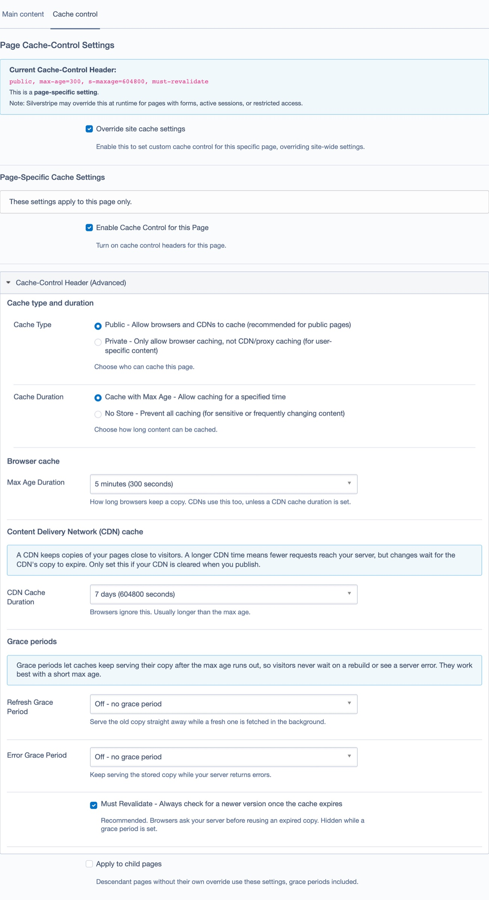

# Silverstripe Cache Control

[](https://github.com/edwilde/silverstripe-cache-control/actions/workflows/ci.yml)

A Silverstripe CMS module that gives content editors control over HTTP Cache-Control headers at both site-wide and page-specific levels.



## Features

- **Site-wide cache control settings** via SiteConfig
- **Page-level cache control overrides** for granular control
- **User-friendly CMS interface** with clear explanations for non-developers
- **Conditional field visibility** using DisplayLogic
- **Performance optimised** - minimal database queries
- **Sensible defaults** - 120 seconds cache time
- **Cache inheritance** - optionally apply cache settings to all descendant pages (opt-in via config)
- **Stale grace periods** - `stale-while-revalidate` and `stale-if-error` for CDN micro-caching (opt-in per site or page)
- **CDN cache duration** - `s-maxage` to give CDNs a longer cache lifetime than browsers (opt-in per site or page, public cache type only)

## Version Compatibility

| Version | Branch | CMS Version | PHP Version |
|---------|--------|-------------|-------------|
| 2.x     | `main` | CMS 6       | PHP 8.3+    |
| 1.x     | `cms5` | CMS 5       | PHP 8.1+    |

## Requirements

- Silverstripe CMS 6.0+
- PHP 8.3+
- [nswdpc/silverstripe-cache-headers](https://github.com/nswdpc/silverstripe-cache-headers) ^2.0.0
- [unclecheese/display-logic](https://github.com/unclecheese/silverstripe-display-logic) ^4.0

## Installation

```bash
composer require edwilde/silverstripe-cache-control
```

All dependencies are stable releases, so no `minimum-stability` changes are needed in your project's `composer.json`.

After installation, run:

```bash
vendor/bin/sake dev/build flush=1
```

## Usage

### Site-wide Settings

Navigate to **Settings > Cache Control** in the CMS to configure default cache headers:

- **Enable Cache Control**: Master switch for the entire site
- **Cache Type**: Choose between Public (CDN + browser) or Private (browser only)
- **Cache Duration**: Choose between Max Age (time-based caching) or No Store (no caching)
- **Max Age Duration**: Select from common preset durations (2 min, 5 min, 10 min, 1 hour, 1 day) or choose Custom
- **Custom Max Age**: When "Custom" is selected, enter your own cache duration in seconds
- **CDN Cache Duration** (`s-maxage`): How long a CDN may keep its copy, separately from the browser max age. Off by default (CDNs use the same time as Max Age Duration), with presets from 5 minutes to 30 days or Custom. Shown only when the cache type is Public
- **Custom CDN Cache Duration**: When "Custom" is selected, enter your own value in seconds, up to one year
- **Refresh Grace Period** (`stale-while-revalidate`): How long a CDN may serve the expired copy while fetching a fresh one in the background. Off by default, with presets from 5 minutes to 7 days or Custom
- **Custom Refresh Grace Period**: When "Custom" is selected, enter your own value in seconds, up to one year
- **Error Grace Period** (`stale-if-error`): How long a CDN may keep serving the stored copy while the server returns errors. Off by default, with presets from 1 hour to 30 days or Custom
- **Custom Error Grace Period**: When "Custom" is selected, enter your own value in seconds, up to one year
- **Enable Must Revalidate**: Force validation when cache expires. Omitted, and hidden in the CMS, whenever a grace period is set

### Vary Header Settings

The **Vary Header** section in site-wide settings controls which request headers cause separate cache entries to be stored. This tells browsers and CDNs to cache different versions of a page based on these headers:

- **Accept-Encoding**: Store separate entries for different compression methods (gzip, br, etc). Enabled by default and recommended for most sites.
- **X-Forwarded-Protocol**: Store separate entries for HTTP vs HTTPS requests.
- **Cookie**: Store separate entries when cookies differ. Use for personalised content.
- **Authorization**: Store separate entries based on authentication. Use for protected content.

Vary headers are configured site-wide only — they apply consistently to all pages, including those with page-level cache control overrides.

### Page-specific Overrides

Each page has a **Cache Control** tab where you can:

1. View the current effective cache control header
2. Enable override to set page-specific settings
3. Configure the same options as site-wide settings

The page will show whether settings are inherited from site config or overridden at the page level.

### Cache Inheritance (Section-Level Overrides)

For sites with large sections that need different cache settings (e.g., an `/archive` section with 1000+ pages), you can configure a parent page's cache settings to automatically apply to all its descendant pages.

This feature is **disabled by default** because it adds database queries per request to walk the page tree. Enable it in your project's YAML config:

```yaml
# app/_config/cache-control.yml
SilverStripe\CMS\Model\SiteTree:
  enable_cache_inheritance: true
```

Once enabled:

1. Navigate to the parent page (e.g., `/archive`) in the CMS
2. Enable **Override Site Cache Settings**
3. Configure the desired cache settings (e.g., 1 day / 86400 seconds)
4. Check **Apply to child pages**
5. Save

All descendant pages that don't have their own cache override will now use the parent's cache settings. The Cache Control tab on each child page will show the inherited source (e.g., "inherited from Archive").

Descendants inherit the cache type, the cache duration, max age, must-revalidate, and both grace
periods. Vary headers are site-wide and never inherit from a page.

**How inheritance resolves:**

1. If a page has its own cache override → uses its own settings
2. If an ancestor has "Apply to child pages" enabled → uses the **nearest** ancestor's settings
3. Otherwise → uses site-wide settings

> [!NOTE]
> This uses runtime tree-walking, not save-time propagation. Changes to a parent's cache settings take effect immediately on the next request to any child page. There is no need to re-save child pages.

> [!TIP]
> For typical Silverstripe sites with 3-5 levels of page depth, the performance overhead is minimal (1-4 additional database queries per uncached request). If your site has deeply nested page trees, consider whether the convenience outweighs the query cost.

### Draft Cache Reduction

When a page has been saved but not published, its cache time is automatically reduced to 10 seconds. This ensures that when the page is eventually published, CDN caches expire quickly and visitors see the new content sooner.

This feature is controlled by the "Reduce cache time for pages with unpublished changes" checkbox in **Settings > Cache Control > Cache-Control Header (Advanced)**, and is **enabled by default on new installs**.

> [!IMPORTANT]
> On an **existing site** upgrading to this version, the new setting is added to your already-saved configuration in the **off** state, so the feature starts out disabled. Open **Settings > Cache Control**, ensure the checkbox is ticked, and save once to enable it. (The default-on value only applies to newly created `SiteConfig` records via `populateDefaults()`; it does not retroactively switch on a `SiteConfig` row that already exists in your database.)

**How it works:**

1. Editor saves a page (creates a draft) without publishing
2. The page's cache max-age is automatically reduced to 10 seconds
3. When the editor publishes, the normal cache time is restored
4. If the editor discards draft changes, the normal cache time is also restored

The reduced cache time (default 10 seconds) can be overridden via YAML config:

```yaml
SilverStripe\CMS\Model\SiteTree:
  draft_cache_max_age: 30
```

> [!NOTE]
> The draft detection uses a flag set at save time, not a per-request database query. This means zero performance overhead at request time.

### Stale Content Grace Periods

A grace period lets a CDN keep serving its stored copy after the max age runs out, instead of
holding every visitor while PHP rebuilds the page. Two directives control this, and both are
**off by default** — no header changes until an editor opts in.

The recommended starting recipe pairs a short max age with a long grace period:

```
Cache-Control: public, max-age=120, stale-while-revalidate=3600, stale-if-error=604800
```

- **`max-age=120`** collapses traffic spikes. Every visitor in the same two minutes is served
  from one PHP render.
- **`stale-while-revalidate=3600`** lets the CDN serve the expired copy instantly for up to an
  hour while it fetches a fresh one in the background. No visitor waits for the origin, and a
  stampede at expiry becomes a single request.
- **`stale-if-error=604800`** tells the CDN to discard a 5xx or a timeout and keep serving the
  last good copy for up to a week. Without it, `stale-while-revalidate` will cache an error page
  and serve it onward.

Set both in **Settings > Cache Control > Cache-Control Header (Advanced)**, or per page on the
page's own Cache Control tab.

> [!IMPORTANT]
> Enabling either grace period removes `must-revalidate` from the header, and the checkbox is
> hidden while one is set. `must-revalidate` forbids reusing a stale response without
> revalidating, which is exactly what a grace period asks a cache to do, so a header carrying
> both has no grace period at all.

A refresh grace period of a day or more is the aggressive variant. It only makes sense with a CDN
purge on publish, which this module does not provide — without one, a low-traffic page can serve
its previous copy to the first visitor after a publish.

> [!WARNING]
> While the origin is returning errors, `stale-if-error` keeps the CDN serving the last public
> copy even after the page is unpublished or its viewing permissions are tightened. That copy stays
> in service until the error grace period runs out or the CDN is purged.

With a `private` cache type, CDNs ignore both grace periods. Only the visitor's browser applies
them, and most browsers ignore `stale-if-error`.

Draft cache reduction lowers `max-age` but leaves the grace periods untouched, so a page with
unpublished changes revalidates every 10 seconds while the CDN continues to answer instantly
from its stored copy.

> [!NOTE]
> Cloudflare, Fastly, Akamai and Varnish honour RFC 5861. Some CDN and WAF products ignore
> `stale-if-error`. The module emits the directives; acting on them is up to the edge.

### CDN Cache Duration

By default, a CDN keeps its copy for the same time as the browser (`max-age`). The CDN cache
duration setting gives the CDN a longer lifetime of its own, via `s-maxage`, which browsers
ignore:

```
Cache-Control: public, max-age=300, s-maxage=604800
```

Here browsers revalidate after 5 minutes, but the CDN keeps serving its copy for 7 days. This
only makes sense when the CDN is cleared on publish — otherwise a visitor can see a stale page
for as long as the CDN cache duration allows. It only applies to a **public** cache type; a
private page never emits `s-maxage`.

Set it in **Settings > Cache Control > Cache-Control Header (Advanced)**, or per page on the
page's own Cache Control tab, directly under Max Age Duration. It combines with the stale grace
periods and with draft cache reduction, which caps `s-maxage` to the same short value as
`max-age` while a page has unpublished changes.

> [!IMPORTANT]
> Turning on cache control in the CMS with no CDN cache duration set removes any `s-maxage`
> already present on the response — for example one added by project code in
> `PageController::init()`. This keeps the CMS header preview honest, but is a behaviour change
> for a project that was relying on its own `s-maxage`.

## Cache Control Options Explained

### Public vs Private
- **Public**: Content can be cached by browsers, CDNs, and proxy servers. Best for pages that are the same for all users.
- **Private**: Content can only be cached by the user's browser. Use for personalised content.

### Max Age
Specifies how long (in seconds) the content can be cached before it must be revalidated. The module provides a dropdown with common preset values for ease of use:
- **2 minutes** (120 seconds) - Default, good for frequently updated content
- **5 minutes** (300 seconds) - Balance between freshness and performance
- **10 minutes** (600 seconds) - For moderately static content
- **1 hour** (3600 seconds) - For content that changes infrequently
- **1 day** (86400 seconds) - For highly static content
- **Custom** - Enter your own value in seconds for specific requirements

### CDN Cache Duration (`s-maxage`)
How long a CDN may keep its copy, independently of the browser's max age. Off by default, meaning the CDN uses the same time as Max Age Duration. Presets run from 5 minutes to 30 days, plus a custom value in seconds. Public cache type only.

### Stale While Revalidate (Refresh Grace Period)
How long a cache may serve its expired copy while fetching a fresh one in the background. Presets run from 5 minutes to 7 days, plus a custom value in seconds. Off by default.

### Stale If Error (Error Grace Period)
How long a cache may keep serving its stored copy while the origin returns errors or times out. Presets run from 1 hour to 30 days, plus a custom value in seconds. Off by default.

### Must Revalidate
Forces browsers to check with the server when the cache expires, rather than serving potentially stale content. Enabled by default. It is omitted from the header, and hidden in the CMS, whenever a grace period is set.

### Cache Duration: No Store
Completely prevents caching. Use for sensitive or rapidly changing content. When "No Store" is selected, all other caching options (max-age, grace periods, must-revalidate) are ignored and the Cache-Control header will only contain "no-store".

## Technical Details

### Architecture

The module consists of three main components:

1. **CacheControlSiteConfigExtension**: Adds cache control fields to SiteConfig
2. **CacheControlPageExtension**: Adds page-level override functionality and optional cache inheritance from parent pages
3. **CacheControlContentControllerExtension**: Applies the appropriate cache control headers to responses, resolving from page override → ancestor inheritance → site config

### HTTP Headers

The module sets the following HTTP headers:

- **Cache-Control**: The primary caching directive (e.g., `public, max-age=300`, or
  `public, max-age=120, stale-while-revalidate=3600, stale-if-error=604800` with grace periods set)
- **Expires**: Automatically set to match the Cache-Control max-age for HTTP/1.0 compatibility

When max-age is specified, the Expires header is calculated as the current time plus the max-age value in GMT format. This ensures compatibility with older HTTP/1.0 caches and proxies while maintaining full HTTP/1.1 Cache-Control support.

### Performance Considerations

- The middleware only applies headers when no Cache-Control header already exists
- Page overrides are checked first to avoid unnecessary SiteConfig lookups
- All cache settings are stored as database fields for optimal performance
- No additional queries are made if cache control is disabled
- **Cache inheritance** (`enable_cache_inheritance`) is disabled by default. When enabled, each uncached page request walks up the page tree (typically 3-5 levels) to find an ancestor with "Apply to child pages" enabled. This adds O(d) queries where d is the tree depth. When disabled, zero additional queries are made — behaviour is identical to the module without this feature.
- **Draft cache reduction** uses a flag set at save time (`onAfterWrite`/`onAfterPublish`), not a per-request version comparison. This means zero additional database queries at request time — the flag is already loaded in the page object.

### Middleware Priority

The middleware runs after request processors to ensure it can detect the current page context. It will not override any Cache-Control headers already set by controllers or other middleware.

## Development

### Development with Symlinks

If you're developing this module and using a symlink in a Silverstripe project:

1. The module's `vendor/` directory should be excluded from Silverstripe's class manifest
2. Either remove the vendor directory from the module when symlinking:
   ```bash
   cd ~/Sites/modules/silverstripe-cache-control
   rm -rf vendor/
   ```

3. Or configure your project to exclude the symlinked vendor directory

This prevents class conflicts when Silverstripe scans for classes.

### Running Tests

```bash
vendor/bin/phpunit
```

### Test Coverage

The module includes comprehensive PHPUnit tests covering:
- SiteConfig extension functionality
- Page extension functionality
- Cache header generation logic
- Override and fallback mechanisms

### Manual Testing of Cache Headers

Cache headers are only applied in `test` or `live` environment modes. To verify headers are being set correctly:

```bash
# Test site-level settings (page without override)
curl -s -D - -k "https://yoursite.local/page-without-override" | grep -i "^cache-control\|^expires\|^vary"

# Test page-level override
curl -s -D - -k "https://yoursite.local/page-with-override" | grep -i "^cache-control\|^expires\|^vary"
```

Expected output when cache control is enabled with max-age=300:
```
cache-control: public, must-revalidate, max-age=300
expires: Thu, 18 Dec 2025 05:00:00 GMT
vary: Accept-Encoding
```

With both grace periods set, `must-revalidate` is replaced by the two stale directives:

```bash
curl -sI "https://yoursite.local/page-with-grace-period" | grep -i cache-control
```

```
cache-control: public, max-age=120, stale-while-revalidate=3600, stale-if-error=604800
```

> [!TIP]
> Headers will not appear in `dev` mode by default. You have two options:

1. **Switch to test/live mode** (recommended for production-like testing):
   ```
   # In your .env file
   SS_ENVIRONMENT_TYPE="test"
   ```

2. **Enable dev mode bypass** (for rapid development/testing):
   ```
   # In your .env file
   CACHE_HEADERS_IN_DEV="true"
   ```

   When `CACHE_HEADERS_IN_DEV` is enabled:
   - Cache headers will be applied in dev mode
   - All the same rules for restricted pages apply
   - Pages with forms or restricted access won't be cached
   - This is useful for testing cache behaviour without switching environment modes

## License

BSD-3-Clause

## Contributing

Contributions are welcome! Please submit pull requests with tests for any fixes or new features.

## Thanks :pray:

- [nswdpc/silverstripe-cache-headers](https://github.com/nswdpc/silverstripe-cache-headers) - For the underlying cache header logic and inspiration
- [unclecheese/display-logic](https://github.com/unclecheese/silverstripe-display-logic) - For conditional field display logic
